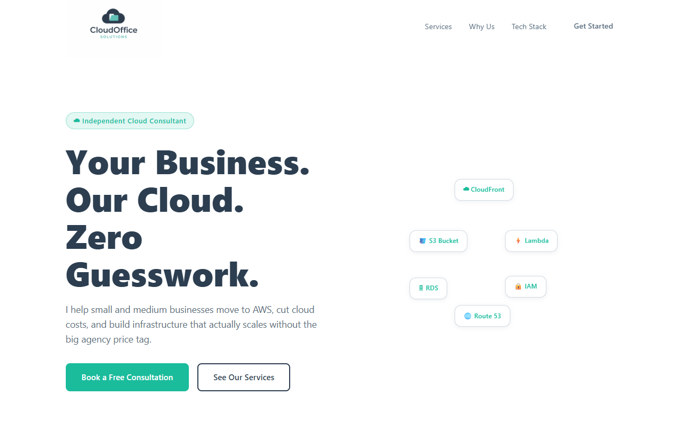
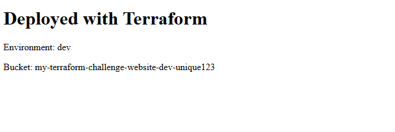
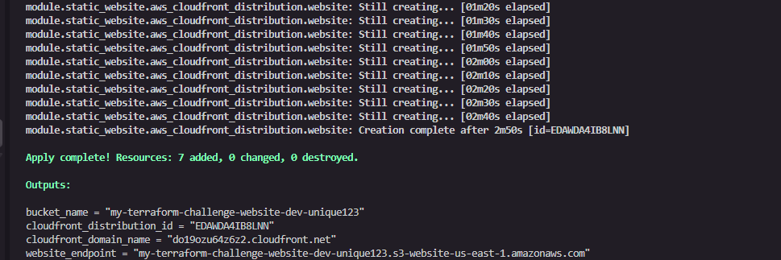
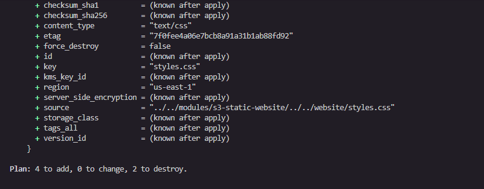

# Day 25 — Deploy a Static Website on AWS S3 with Terraform

> **30-Day Terraform Challenge — Final Project**
> The capstone. Everything from the last 24 days; modular code, remote state, DRY configuration, environment isolation, version control, and consistent tagging applied in one complete, production-shaped project.

---

## What Was Required

The challenge for Day 25 was to deploy a fully functional static website on AWS using **S3** and **CloudFront**, built entirely with Terraform, following every best practice covered across the 30-day challenge:

| Requirement | Description |
|---|---|
| Modular code | Reusable `s3-static-website` module, separate from the calling environment |
| Remote state | S3 backend with DynamoDB state locking |
| DRY configuration | All complexity lives in the module; the environment config stays clean |
| Environment isolation | `envs/dev/` structure, ready to extend to `staging` and `production` |
| Variable validation | `environment` variable enforces only `dev`, `staging`, or `production` |
| Consistent tagging | `locals` merges caller tags with mandatory `Environment`, `ManagedBy`, `Project` |
| CloudFront distribution | Global CDN with HTTPS redirect, caching, and `PriceClass_100` |
| Bonus — Custom Domain | Route53 + ACM certificate setup (see note below) |

---

## Live Website



> The live website served over HTTPS via CloudFront, a real landing page for CloudOffice Solutions, a personal AWS cloud consultancy.

---

## My Approach — A Real Static Website Instead

The task provided a minimal placeholder HTML page as a starting point. Rather than stop there, I chose to build and deploy a **real, production-quality static website**; a landing page for **CloudOffice Solutions**, a personal cloud consultancy business that helps SMBs move to and thrive on AWS.

### Why?
- A real website is a far better portfolio piece than a "Hello World" placeholder
- It demonstrates that the Terraform infrastructure actually works end-to-end serving real HTML, CSS, JavaScript, and image assets
- It shows the `for_each` pattern for uploading multiple S3 objects with correct `Content-Type` headers and `etag`-based change detection

### On the Route53 Bonus
The bonus task required a custom domain registered in Route53. I do not currently have a Route53 domain, so I did not complete the Route53/ACM portion. Instead, the website is served over HTTPS via the **CloudFront default certificate** on a `*.cloudfront.net` domain, which is exactly what the main task requires and what the submission asks for in the *Live App Link* field.



> CloudFront serving the site over HTTPS on the default `*.cloudfront.net` domain.

---

## Project Structure

```
day25-static-website/
├── backend.tf                          # S3 remote state + DynamoDB locking
├── provider.tf                         # AWS provider, version constraints
├── modules/
│   └── s3-static-website/
│       ├── main.tf                     # All AWS resources
│       ├── variables.tf                # 5 input variables
│       └── outputs.tf                  # 4 outputs
├── envs/
│   └── dev/
│       ├── main.tf                     # Module call
│       ├── variables.tf                # Environment-level variable declarations
│       ├── outputs.tf                  # Passes module outputs up
│       └── terraform.tfvars            # Actual values for dev
└── website/
    ├── index.html                      # Landing page
    ├── styles.css                      # Full stylesheet
    ├── main.js                         # Interactivity & dynamic content
    ├── error.html                      # Custom 404 page
    └── CloudOffice-Solutions-logo.png  # Brand logo
```

---

## The Module — `modules/s3-static-website`

### `variables.tf`

| Variable | Type | Default | Required | Purpose |
|---|---|---|---|---|
| `bucket_name` | `string` | — | ✅ | Globally unique S3 bucket name. No default because it must be unique per deployment |
| `environment` | `string` | — | ✅ | Deployment environment. No default — forces the caller to be explicit. Validated against `dev`, `staging`, `production` |
| `tags` | `map(string)` | `{}` | ❌ | Extra tags from the caller, merged with mandatory module tags |
| `index_document` | `string` | `index.html` | ❌ | S3 website index document. Has a sensible default |
| `error_document` | `string` | `error.html` | ❌ | S3 website error document. Has a sensible default |

The two required variables, `bucket_name` and `environment` have no defaults intentionally. A bucket name must be globally unique and an environment must be a conscious choice. Defaulting either would hide mistakes.

### `main.tf` — Resources

```hcl
locals {
  common_tags = merge(var.tags, {
    Environment = var.environment
    ManagedBy   = "terraform"
    Project     = "static-website"
  })

  website_files = {
    "index.html"                    = { path = "...", content_type = "text/html" }
    "styles.css"                    = { path = "...", content_type = "text/css" }
    "main.js"                       = { path = "...", content_type = "application/javascript" }
    "error.html"                    = { path = "...", content_type = "text/html" }
    "CloudOffice-Solutions-logo.png" = { path = "...", content_type = "image/png" }
  }
}
```

| Resource | Purpose |
|---|---|
| `aws_s3_bucket` | Creates the bucket. `force_destroy = true` for non-production so `terraform destroy` works cleanly |
| `aws_s3_bucket_website_configuration` | Enables S3 static website hosting with index and error documents |
| `aws_s3_bucket_public_access_block` | Disables all public access blocks so the bucket policy can make objects readable |
| `aws_s3_bucket_policy` | Applies a public `s3:GetObject` policy. `depends_on` the access block to avoid race conditions |
| `data.aws_iam_policy_document` | Generates the bucket policy JSON cleanly without inline JSON strings |
| `aws_cloudfront_distribution` | Global CDN. HTTP → HTTPS redirect, 1-hour default TTL, `PriceClass_100` (US/EU/Asia edge locations) |
| `aws_s3_object` (for_each) | Uploads all 5 website files. `etag = filemd5()` ensures Terraform re-uploads on any file change |

**Key design decision — `for_each` for file uploads:**

Instead of one `aws_s3_object` resource per file, a single resource with `for_each` handles all files. Adding a new asset to the website only requires adding one line to the `website_files` map no new resource blocks needed.

```hcl
resource "aws_s3_object" "website_files" {
  for_each     = local.website_files
  bucket       = aws_s3_bucket.website.id
  key          = each.key
  source       = each.value.path
  content_type = each.value.content_type
  etag         = filemd5(each.value.path)
}
```

### `outputs.tf`

| Output | Value |
|---|---|
| `bucket_name` | The S3 bucket ID |
| `website_endpoint` | The S3 website endpoint (HTTP only) |
| `cloudfront_domain_name` | The CloudFront `*.cloudfront.net` URL — the one to use in a browser |
| `cloudfront_distribution_id` | The distribution ID, needed for cache invalidations |

---

## The Calling Configuration — `envs/dev`

```hcl
# envs/dev/main.tf
module "static_website" {
  source = "../../modules/s3-static-website"

  bucket_name    = var.bucket_name
  environment    = var.environment
  index_document = var.index_document
  error_document = var.error_document

  tags = {
    Owner = "terraform-challenge"
    Day   = "25"
  }
}
```

```hcl
# envs/dev/terraform.tfvars
bucket_name    = "my-terraform-challenge-website-dev-unique123"
environment    = "dev"
index_document = "index.html"
error_document = "error.html"
```

The calling configuration is intentionally thin. It passes values in and nothing else. All the resource logic, tagging, and wiring lives inside the module. This is the DRY principle in practice, if a `staging` or `production` environment were added tomorrow, it would be another `envs/staging/` folder with the same clean 12-line `main.tf`, pointing at the same module.

**What it would look like without a module — a single flat file:**
Without the module, `envs/dev/main.tf` would contain every `aws_s3_bucket`, `aws_s3_bucket_website_configuration`, `aws_s3_bucket_public_access_block`, `aws_s3_bucket_policy`, `aws_cloudfront_distribution`, and `aws_s3_object` resource block directly. That is 120 lines of resource code duplicated in full for every environment. A bug fix or tag change would need to be applied in every copy. The module means it is fixed once, everywhere.

---

## Remote State — `backend.tf`

```hcl
terraform {
  backend "s3" {
    bucket         = "your-terraform-state-bucket"
    key            = "day25/static-website/dev/terraform.tfstate"
    region         = "us-east-1"
    dynamodb_table = "terraform-state-locks"
    encrypt        = true
  }
}
```

The state file lives in S3, encrypted at rest. DynamoDB provides a lock so two `terraform apply` runs can never corrupt the state simultaneously. The `key` path `day25/static-website/dev/terraform.tfstate` is structured so that `staging` and `production` would each get their own state file under the same bucket, fully isolated.

---

## The Website — CloudOffice Solutions

Rather than deploy a placeholder, I built a complete landing page for **CloudOffice Solutions** a personal cloud consultancy that helps small and medium businesses move to AWS.

### Pages
| File | Purpose |
|---|---|
| `index.html` | Full landing page — nav, hero, AWS services strip, service cards, stats, tech stack, contact form, footer |
| `error.html` | Branded 404 page that reuses the same stylesheet |

### Features
- Responsive layout — works on mobile, tablet, and desktop
- Sticky navbar with scroll-triggered background
- Animated AWS architecture diagram in the hero section
- Animated counters in the stats section (triggered on scroll via `IntersectionObserver`)
- Dynamic service cards and tech stack grid rendered from JavaScript data arrays
- Contact form with client-side validation
- Brand colours from the CloudOffice Solutions identity: Charcoal `#2C3E50`, Teal `#1ABC9C`, White `#FFFFFF`

### Brand Colour Usage
| Colour | Hex | Usage |
|---|---|---|
| Dark Charcoal | `#2C3E50` | Body text, headings, nav links |
| Deep Charcoal | `#1F2D3A` | Footer, contact section background |
| Teal | `#1ABC9C` | Buttons, badges, stat numbers, hover accents |
| Soft Teal | `#48C9B0` | Button hover states |
| White | `#FFFFFF` | Page background, card backgrounds |

---

## Deployment

### Prerequisites
- Terraform >= 1.0
- AWS CLI configured with appropriate credentials
- An existing S3 bucket and DynamoDB table for remote state

### Steps

```bash
# 1. Clone the repo and navigate to the dev environment
cd envs/dev

# 2. Initialise — downloads the AWS provider and configures the S3 backend
terraform init

# 3. Validate configuration
terraform validate

# 4. Preview changes
terraform plan

# 5. Deploy
terraform apply

# 6. Get your live URL
terraform output cloudfront_domain_name
```

Open the CloudFront URL in your browser. CloudFront distributions take **5–15 minutes** to fully propagate globally after first creation.



> `terraform apply` completing successfully — all resources created.

### Updating the Website

After any change to files in `website/`:

```bash
terraform apply
aws cloudfront create-invalidation --distribution-id <distribution_id> --paths "/*"
```

The `etag = filemd5(each.value.path)` on the `aws_s3_object` resource ensures Terraform detects file changes and re-uploads only what has changed. The CloudFront invalidation clears the CDN cache so browsers receive the updated files immediately.



> `terraform plan` after adding the real website files showing the 5 S3 objects to be uploaded.

---

## Clean Up

```bash
terraform destroy
```

The `force_destroy = var.environment != "production"` setting on the S3 bucket means Terraform can delete the bucket even when it contains objects, but only for `dev` and `staging`. A `production` bucket is protected and must be emptied manually before destroy, preventing accidental data loss.

---

## What I Learned

This project was the most complete thing I built across the entire 30-day challenge. A few things that stood out:

**Modules are not just about reuse — they are about clarity.** The calling configuration in `envs/dev/main.tf` is 12 lines. Anyone reading it immediately understands what is being deployed and what values it takes. The complexity is encapsulated, not hidden.

**`etag = filemd5()` is the right way to manage static assets in Terraform.** Without it, Terraform has no way to know a file changed on disk. With it, every `terraform apply` is a reliable sync between your local `website/` folder and S3.

**CloudFront cache invalidation is a required step in the workflow.** Deploying new files to S3 is not enough, CloudFront serves cached copies from its edge locations until the cache expires or is explicitly invalidated. This is easy to forget and causes confusing "why isn't my change showing up?" moments.

**Remote state is not optional on real projects.** Even working alone, the S3 backend with DynamoDB locking means the state is safe, versioned, and accessible from any machine. Local state is a liability.

**The DRY principle has a compounding return.** Every best practice applied here; modules, variables, locals, for_each individually saves a little time. Together, they produce infrastructure that is readable, maintainable, and extensible without rewriting anything.

---

## Conclusion

This project brought together everything; S3, CloudFront, Terraform modules, remote state, DRY configuration, environment isolation, and consistent tagging into one complete, working deployment. Not a placeholder, but a real website with real assets, served globally over HTTPS, built entirely through code.

The biggest takeaway is that none of these practices exist in isolation. Modules make environments clean. Remote state makes collaboration safe. `etag`-based uploads make asset management reliable. CloudFront invalidations make deployments complete. Each piece depends on the others, and when they all work together, the result is infrastructure you can trust, hand off, and build on.

There is still more to learn; Route53 custom domains, ACM certificates, CI/CD pipelines that run `terraform apply` automatically, multi-region deployments. But this project is a solid, honest foundation. Everything here is production-shaped, not just challenge-shaped.

---

## Let's Connect

If this project was useful, interesting, or sparked an idea I'd love to hear from you. I write about cloud infrastructure, AWS, and Terraform on Medium, and share what I'm building and learning on LinkedIn.

- **Read the full write-up on Medium** → [medium.com/@ntinyaribelinda](https://medium.com/@ntinyaribelinda)
- **Connect on LinkedIn** → [linkedin.com/in/belinda-ntinyari](https://www.linkedin.com/in/belinda-ntinyari/)

If you're working through the **#30DayTerraformChallenge** yourself, or you're just getting started with AWS and Terraform, feel free to reach out. Always happy to help, compare notes, or just talk cloud.

> ⭐ If you found this repository helpful, a star goes a long way, it helps others find it too.

---

*Deployed on AWS S3 + CloudFront · Infrastructure as Code with Terraform · #30DayTerraformChallenge*
